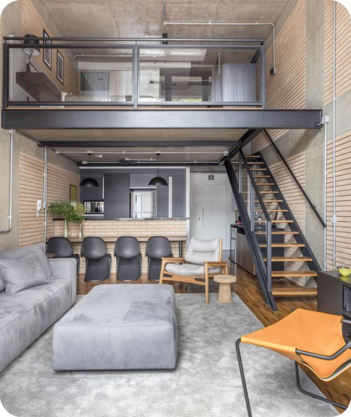

Link do site disponibilizado: https://desafio-landing-page-arquitetura-dnc.netlify.app/

Link da planilha de registro de informação: https://docs.google.com/spreadsheets/d/1XM5NkKl-AWFK96BX0I2YH3X25IexT8sMuPlEljJPYo4/edit#gid=0

# Desafio-Landing-Page-Arquitetura

## Este é um desafio de desenvolvimento de uma Landing Page de Arquitetura.


```
Códigos HTML:5 utilizados:

<!DOCTYPE html>
<html lang="pt-br">
<head>
    <meta charset="UTF-8">
    <meta name="viewport" content="width=device-width, initial-scale=1.0">
    <link rel="preconnect" href="https://fonts.googleapis.com">
    <link rel="preconnect" href="https://fonts.gstatic.com" crossorigin>
    <link href="https://fonts.googleapis.com/css2?family=Inter:wght@100;200;300;400;500;600;700;800;900&display=swap" rel="stylesheet">
    <link rel="stylesheet" href="style.css">
    <title>Escola DNC</title>
</head>
<body>

    <!-- MENU SUPERIOR -->
    <div id="menusuperior">
        <h1 id="titulo-menusuperior">Tradição em projetos de arquitetura</h1>
        <p id="texto-menusuperior"> Arquitetura residencial e comercial. </p>
    </div>

      <!-- MENU NFORMACIONAL -->
      <div id="menuinformacional">
    
        <h1 id="titulo-menuinformacional">850</h1>
        <p id="texto-menuinformacional">empreendimentos construídos</p>
        <h1 id="titulo-menuinformacional">40</h1>
        <p id="texto-menuinformacional-2">empreendimentos construídos</p>
        <h1 id="titulo-menuinformacional">2,000,000</h1>
        <p id="texto-menuinformacional-3">empreendimentos construídos</p>
    
    </div>
    
    <!-- SEÇÃO ILUSTRATIVO -->
    <div id="secaoilustrativo">   
       <h1 id="tituloilustrativo">
        Arquitetos com História e Experiência.
       </h1>
       <p id="textoilustrativo">
        Nós realizamos desde 2002 projetos e gerenciamento de obras.<br>
        Com mais de 800 projetos e 2.000.000 de m² construídos, tendo<br>
        como principal proposta transformar em realidade os sonhos de<br>
        seus clientes, criando projetos personalizados, unindo a tradição<br>
        e a modernidade em nossos projetos.
       </p>
       
    </div>

    <!--FORMULÁRIO-->
    <div id="formulario">
        <h1 id="titulo-formulario">Conheça mais sobre nossos serviços:</h1>
        <form action="https://api.sheetmonkey.io/form/tzdsCqhhYWCotcYJsuvxQD" method="post">
            <input type="text" placeholder="Nome" name="Name" required> <br>
            <input type="email" placeholder="Email" name="Email" required> <br>
            <input type="hidden" name="Created" value="x-sheetmonkey-current-date-time" />
            <button type="submit">Fale Conosco</button>
        </form>
    </div>
</body>
</html>

Códigos CSS Utilizados:

*{
    margin: 0px;
    font-family:'inter';
}

#titulo-menusuperior{
    margin-top: 100px;
}

#texto-menusuperior{
    margin-top: 10px;
    padding-bottom: 50px;
    font-size: 71%;
}

#menusuperior{
    background-color: #303030;
    color: aliceblue;
    padding: 50px;
}

#menuinformacional{
    background-color: #F9F9F9;
    display: grid;
    grid-auto-flow: column;
}

#titulo-menuinformacional{
    margin-left: 105px;
    margin-top: 70px;
    padding-bottom: 70px;
}

#texto-menuinformacional{
    margin-left: -282px;
    margin-top: 110px;
}

#texto-menuinformacional-2{
    margin-left: -262px;
    margin-top: 110px;
}

#texto-menuinformacional-3{
    margin-left: -387px;
    margin-top: 110px;
}

#secaoilustrativo{
    display: grid;
    grid-auto-flow: column;
}
 
 #tituloilustrativo{
    margin-top: 300px;
    margin-left: 77px;
    margin-bottom: 30px;
}

#textoilustrativo{
    margin-top: 380px;
    margin-left: -840px;
    margin-bottom: 100px;
}
 
 #imagemilustracao{
    margin-top: 80px;
    margin-bottom: 80px;
 }
 
 #formulario{
    font-size: x-small;
     padding: 60px;
     text-align: center;
     color: #FFFFFF;
     background-color: #303030;
 }
 
 input{
     width: 300px;
     height: 40px;
     margin-top: 40px;
     border: 0px;
     border-radius: 5px;
     padding-left: 10px;
     background-color: #EAECE5;
 }
 
 button{
     background-color: #C07212;
     height: 40px;
     width: 150px;
     margin: 60px;
     color:#EAECE5;
     border: 0px;
     border-radius: 5px;
     margin-bottom: 50px;
     font-weight: bolder;
     cursor: pointer;
 }
 
 button:hover{
     background-color: #C07212;
     color: white;
     transform: translateY(-7px);
     transition-duration: 0.5s;
     box-shadow: 0px 15px 20px #464545;
 }
